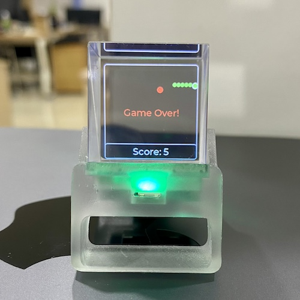
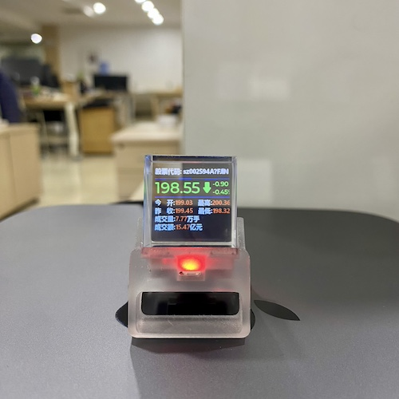
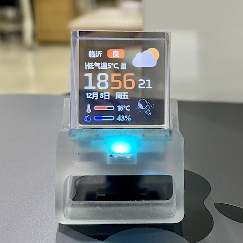
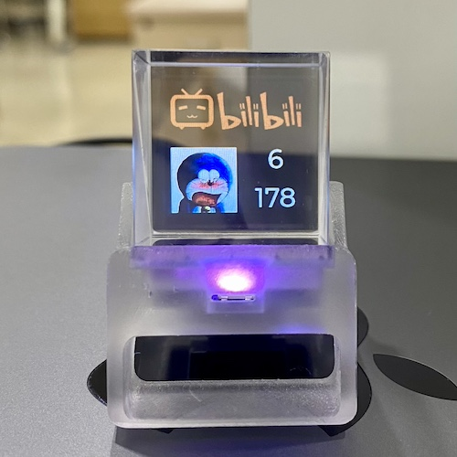
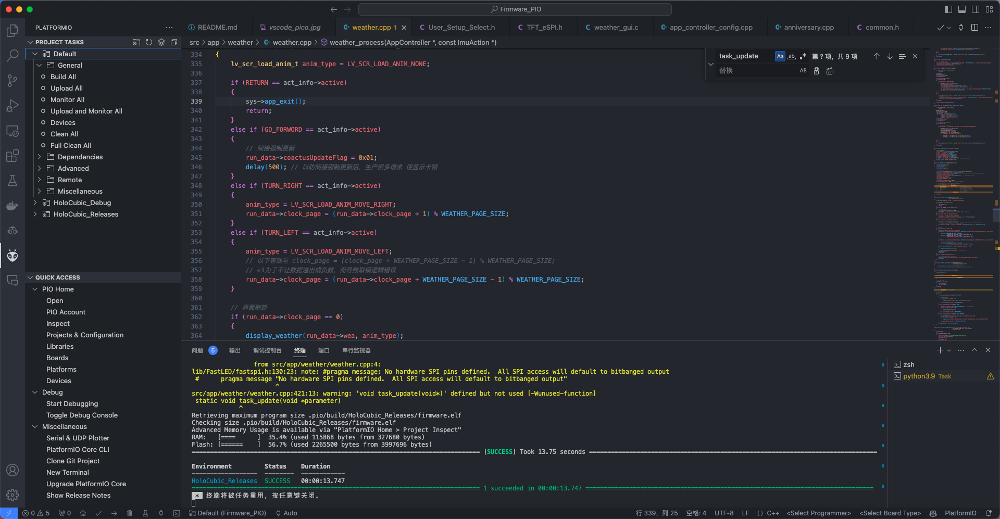

# HoloCubic


===

===

> 基于`稚晖君`大佬的开源项目[HoloCubic](https://github.com/peng-zhihui/HoloCubic)的全息桌面站。<br>
左右倾斜切换APP，后仰进入当前应用，前倾退出该APP。

## 实物
| 贪吃蛇 | 股票看板 | 时钟气象站 | B站粉丝 | 
| :-----: | :-----: | :-----: | :-----: | 
|  |  |  |  | 


## 功能:
- [x] 时钟气象站：[PuYuuu](https://github.com/PuYuuu)<br>
`'tianqi_appid''tianqi_appsecret'`[申请地址](https://www.yiketianqi.com/user/login)
- [x] PC资源监控：[Jumping99](https://github.com/Jumping99)<br>
安装[AIDA64](https://www.aida64.com/downloads)设置[导入](https://www.bilibili.com/video/av200592305)配置文件[aida64_setting.rslcd](https://github.com/niyongsheng/HoloCubic/blob/main/Firmware_PIO/src/app/pc_resource/aida64_setting.rslcd)
- [x] 屏幕分享：[投屏软件240*240|50%](https://gitee.com/superddg123/esp32-TFT)
- [x] 纪念日：[WoodwindHu](https://github.com/WoodwindHu)
- [x] 股票看板：[redwolf](https://github.com/redwolf)
- [x] B站粉丝：[cnzxo](https://github.com/cnzxo)
- [x] 2048：[AndyXFuture](https://github.com/AndyXFuture)
- [X] 贪吃蛇：[niyongsheng](https://github.com/niyongsheng/HoloCubic/tree/main/Firmware_PIO/src/app/game_snake)

* `./SD_Card`中文件拷贝到Fat32格式的存储卡中（TF卡为非必要硬件）

## 配网:
1. 启动`WebSever`应用，连接WiFi名为`HoloCubic_WiFi`的热点。
2. 在浏览器地址栏输入 http://192.168.4.2 或 http://holocubic 即可进入管理后台。

## 开发编译:
VScode上的`PlatformIO`插件中的ESP32-Pico平台开发。
* `platformio.ini`文件中`upload_port`字段修改成刷写固件的设备COM口


## 固件写入:
- 固件下载[工具](https://github.com/espressif/esptool/releases)
- 最新版[固件](https://github.com/niyongsheng/HoloCubic/releases)
- 波特率 `921600` `576000` `460800` `230400` `115200` `57600`
```shell
// windows清空flash
esptool.exe -p COM3 erase_flash

// windows固件写入
esptool.exe \
-p COM3 \
-b 921600 write_flash \
-fm dio \
-fs 8MB \
0x1000 bootloader_qio_80m.bin \
0x00008000 partitions.bin \
0x0000e000 boot_app0.bin \
0x00010000 firmware_v1.0.0.bin
```

```shell
// mac查询usb设备
ls /dev/tty.*

// 修改权限
chmod +x esptool

// 清空flash
./esptool \
--port /dev/tty.usbserial-56A50335151 erase_flash

// mac固件写入
./esptool \
--port /dev/tty.usbserial-56A50335151 \
--baud 460800 write_flash \
-fm dio \
-fs 8MB \
0x1000 bootloader_qio_80m.bin \
0x00008000 partitions.bin \
0x0000e000 boot_app0.bin \
0x00010000 firmware_v1.0.0.bin
```

## 联系方式
* E-mail: niyongsheng@Outlook.com
* Weibo: [@Ni永胜](https://weibo.com/u/7317805089)
