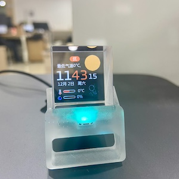
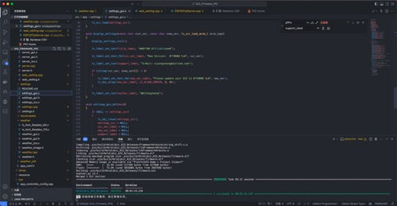
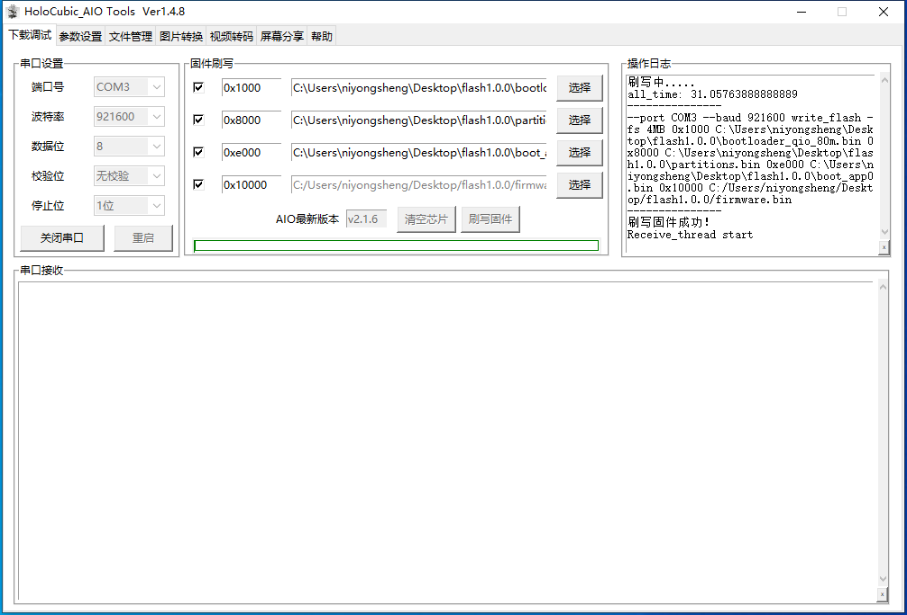

# HoloCubic

===

===

> 基于`稚晖君`大佬的开源项目[HoloCubic](https://github.com/peng-zhihui/HoloCubic)的全息桌面站。 
左右倾斜切换APP，向前倾斜进入当前应用，后仰即退出该APP。

## 实物

## 功能:
- [x] 时钟气象站：[PuYuuu](https://github.com/PuYuuu) 
`'tianqi_appid''tianqi_appsecret'`[申请地址](https://www.yiketianqi.com/user/login)
- [x] 纪念日：[WoodwindHu](https://github.com/WoodwindHu)
- [x] PC资源监控：[Jumping99](https://github.com/Jumping99)
- [x] 股票看板：[redwolf](https://github.com/redwolf)
- [x] B站粉丝：[cnzxo](https://github.com/cnzxo)
- [x] 2048：[AndyXFuture](https://github.com/AndyXFuture)
- [ ] 贪吃蛇：[niyongsheng](https://github.com/niyongsheng)

* `./SD_Card`中文件拷贝到Fat32格式的存储卡中（TF卡为非必要硬件）

## 配网:
1. 启动`WebSever`应用，连接WiFi名为`HoloCubic_WiFi`的热点。
2. 在浏览器地址栏输入 http://192.168.4.2 或 http://holocubic 即可进入管理后台。

## 开发编译:
VScode上的`PlatformIO`插件中的ESP32-Pico平台开发。
* `platformio.ini`文件中`upload_port`字段修改成刷写固件的设备COM口

## 固件写入:
1. `bootloader_qio_80m.bin`启动引导`bootloader`
2. `partitions.bin`分区文件
3. `boot_app0.bin`
4. 最新版[固件](https://github.com/niyongsheng/HoloCubic/releases/)`firmware_bin_XXX.bin`

## 联系方式
* E-mail: niyongsheng@Outlook.com
* Weibo: [@Ni永胜](https://weibo.com/u/7317805089)